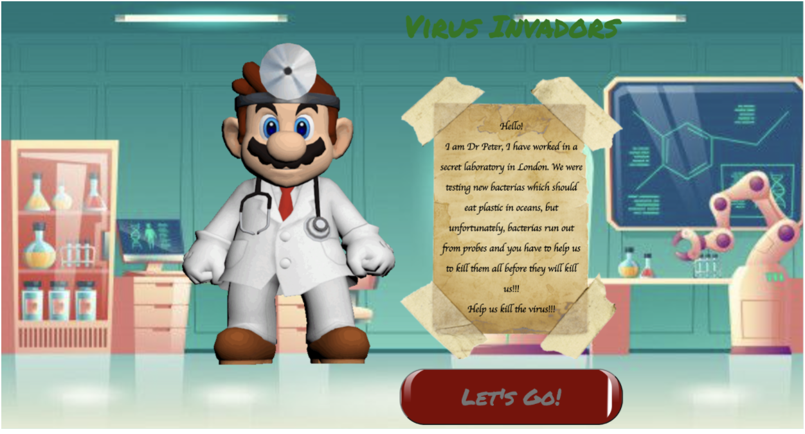
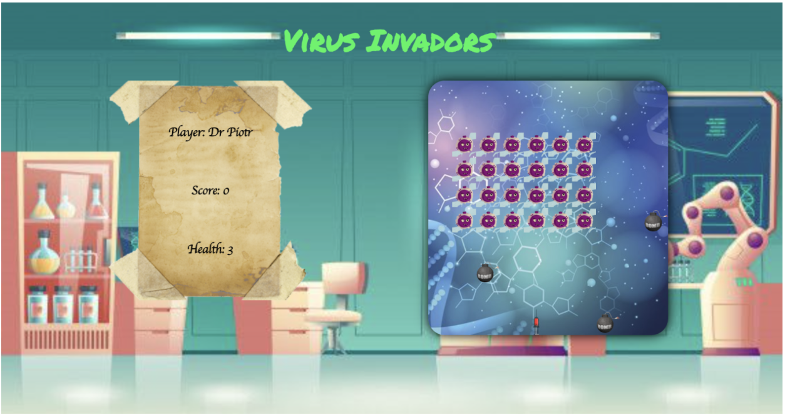
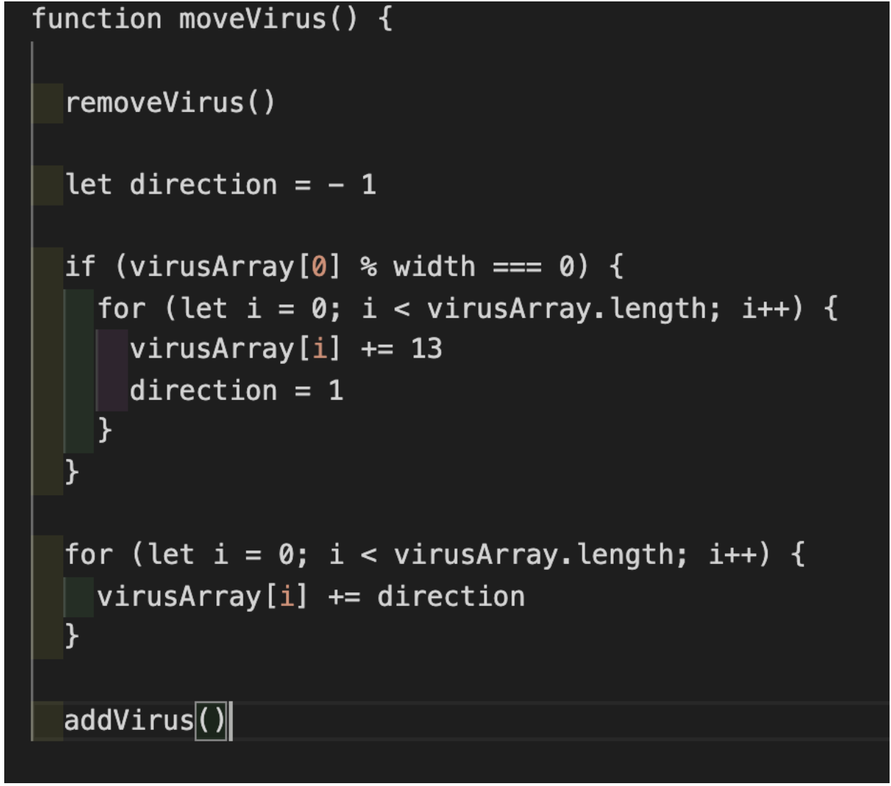
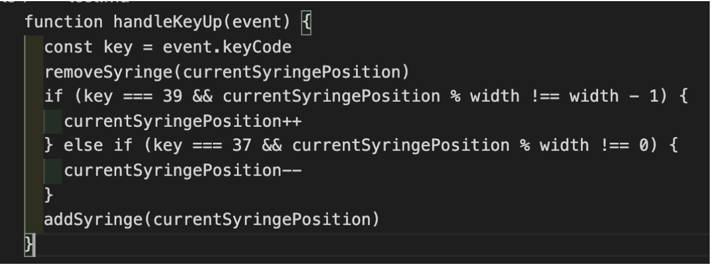
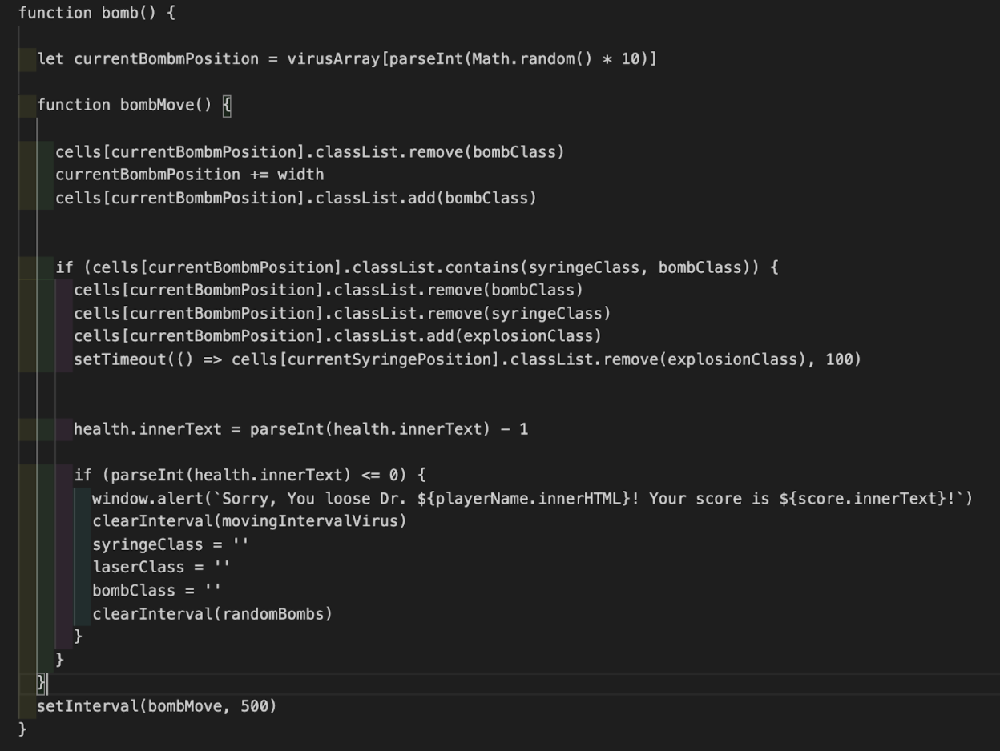
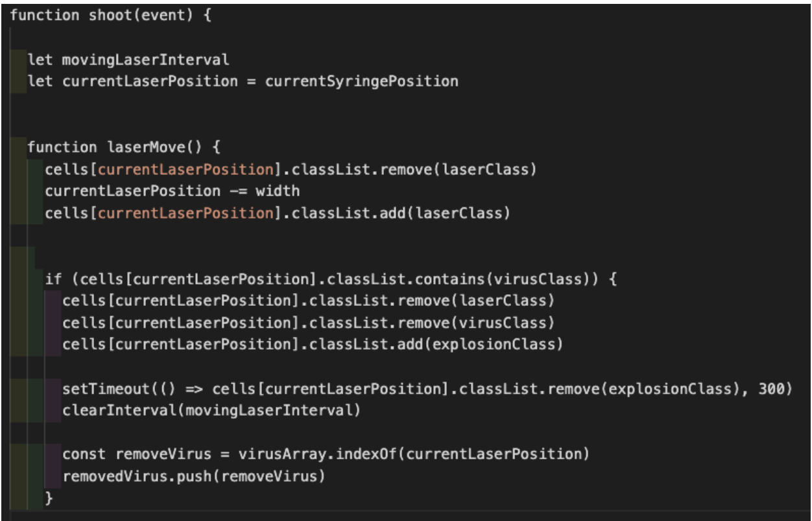

# General Assembly, Project One - Space Invaders Game

## Project Overview

Space Invaders is a classic arcade game from the 80s. The player aims to shoot an invading alien armada before it reaches the planet's surface using a mounted gun turret.

This was my first project from General Assembly's Software Engineering Immersive course. It was an individual project built in 9 days and was the first proper game I had built, and my first real-world type practice with vanilla JavaScript and CSS.

### The game is deployed in GitHub. If you will, you can play **[here](https://janek2204.github.io/SEI-Project-1---The-game/)**!

## Project Brief

- Render a grid-based game in the browser
- Create user space ship
- Invaders have to move in-group from the top to bottom and from left to right
- Aliens should drop random bombs to the player’s spaceship
- Displaying scores and lives for player
- Deploy game online

## Technologies Used

- HTML5 with HTML5 audio
- CSS3 with flexbox
- JavaScript (ES6)
- Git
- GitHub
- Google Fonts

## Timeline and time to build

### Key Dates

**Day 1** - Planning and wireframing \
**Day 2** - Brief and Signoff from course lead \
**Day 3-6** - Building logic and getting MVP \
**Day 7** - Adding extra features \
**Day 8** - Styling \
**Day 9** - Deploying game

#### Day 1:

I spent the first day of the project planning and trying to break it down into manageable chunks. I created a list of features that I wanted the game to have. I have split the project into two parts, full working MVP and extra features to add if I will have spare time to add them. Knowing that this game was grid focused, I spent a fair amount of time thinking and pseudo-coding how to display and move the group of aliens on the grid.

#### Day 2-4:

FFor the MVP, I decided that aliens will move just straight to the bottom, without side to side movement on the grid. With this firm plan in mind, I set creating a grid and aiming to get invaders rendered in the middle of the grid when the page is loaded. Each invader details were stored in an array of objects which included the grid locations.
By the end of Day 3, I had all invaders created on the grid however, they were static. This turned out to be a big blocker for me at the time and took a whole day to work out how to get around this. Eventually, after reaching out to the community for some advice, I had worked out for the invaders to be able to move, I first had to remove them from the current grid and rerender them in new positions. To achieve my plan I used `setInterval()` and `clearInterval()` functions to rerender the array of viruses.

#### Day 5:

After getting the grid fully working and implementing invaders on it, the time has come to add the player’s ship and move it on the grid using arrow keys on the keyboard. I simply repeat the logic of getting invaders added to the grid and instead of using random movement I have added `document.addEventListener('keyup', handleKeyUp)` and based on this event I have built the player’s ship movement.

###### _Note: For the theme, I have chosen “Virus vs Syringe”_ _Virus === Invader_, _Syringe === player’s Spaceship_, _Laser === missile_

#### Day 6:

I had already displayed everything I wanted to display on the screen. Now, it is time to focus on the interaction between the spaceship and the invaders. I have to create bombs that will randomly be shot from the invaders and missiles from a player’s spaceship. By copying the logic from invaders’ behaviour, I got the bombs moving towards the player’s spaceship and get them rendered randomly using `setInterval()` and `Math.random()`. I gave a similar logic also to the missiles. I also added the functionality to remove invaders when hit with missiles and remove 1 life from the player each time hit with a bomb. At this point, my MVP was ready.

#### Day 7:

As my MVP was ready and fully functioning, I decided to add some extra features like:

- Explosion effect when laser will hit an invader
- Sound when shoot()
- Scoreboard
- A player can add his name
- Lives left
- The second wave of invaders
  Most of the new features were expansions of already existing functionalities.

#### Day 8:

I spent the whole day styling and polishing existing features. Using flexbox to organize all content on the page and gifs/images files to give a game a more slick and tidy look. I had some issues getting images to be displayed how they should be. I used the **[w3schools](https://www.w3schools.com/)** site as a primary help reference.

#### Day 9

The game is deployed in Github pages.

## Bugs

- Currently, laser-shooting is causing many console errors. It has to do with creating laser CSS outside of the grid. This bug hasn’t caused a game crash so I decided to leave it for the time being just to move on with the project and deliver MVP on time.
- Invaders are not moving in the way they should. Because of the time limitation, I decided to leave them how are they now, moving from left to right.
- Throughout the build of the project, there were a number of bugs experienced. However, keeping the mindset to create a simple game and trying not to over-complicate things as well as spending lots of time testing has helped me iron out all the smaller bugs and create a simple and fun game.

## Wins and Challenges

- The biggest challenge and most time-consuming function was to get moving invaders on the grid. Once I understood the idea of removing them and rendering them again in the next grid fields I was able to move past this point.

- The biggest win for me in this project was my increased understanding of how to use functions, conditional statements and some array methods. It was my first ever coding challenge with time brackets. I was taken out of my comfort zone and I am very happy with the end result.

## Future features and improvements

- Moving invaders from edge to edge
- Best players scoreboard
- The time limit for each game
- Ability to shoot bombs
- More concise and DRY code in certain areas

## Key Learnings

I have learned from this project that I need to do more refactoring of my code as I am working on the project. At the time, I tried to write understandable, clean and well-annotated code, however, there are certainly sections in this project where I didn't have time to refactor at all and it was a case of adding the working code and getting the job done and moving on to the next feature.
